# ⚡ LiveDocs AI - Data Clusters

<div align="center">

[](https://megalith.co.in/)
[]()
[]()

**Submission for Megalith 2026 | IIT Kharagpur**

*Where Intelligence Meets Instantaneity.*

[Features](#-features) • [Architecture](#-architecture) • [Installation](#-installation-and-setup) • [Live Demo](#-real-time-streaming-capability)

</div>

---

## 📖 Project Overview

**LiveDocs AI** is a Real-Time Retrieval Augmented Generation (RAG) engine designed to solve the critical "Knowledge Cutoff" problem in finance and security.

Unlike traditional RAG systems that require batch re-indexing or server restarts to learn new information, LiveDocs AI leverages the **Pathway Framework** to ingest documents the moment they touch the file system.

**The Result:** A system with **Zero Latency**.

- ✅ Add a file? The AI knows it instantly.
- ✅ Delete a file? The AI forgets it instantly.

---

## 🏗️ Architecture

We utilize a "Just-In-Time" (JIT) processing pipeline powered by Pathway.

```mermaid
graph LR
    A[📂 Data Source] -->|pw.io.fs.read| B(⚡ Pathway Engine)
    B -->|Streaming Vectorization| C{🤖 Llama 3.3 70B}
    D[User Query] --> C
    C -->|Instant Response| E[💬 Gradio Interface]
```



### Tech Stack

| Component | Technology |
|-----------|------------|
| **Engine** | Pathway (Rust-based streaming data processing) |
| **Intelligence** | Llama 3.3 70B (via OpenRouter API) |
| **Embeddings** | Sentence-Transformers (all-MiniLM-L6-v2) |
| **Interface** | Gradio (Reactive UI) |

---

## 🚀 Features

- 🔄 **True Real-Time Updates:** No "re-train" button needed. The system watches the file descriptor.
- ⚡ **Sub-Second Latency:** Queries are processed in <200ms using local vectorization.
- 🔒 **Secure Fallback:** Includes a smart keyword search fallback if the LLM API is unreachable.
- 📂 **Dynamic Context Window:** Automatically adjusts context based on available documents in the stream.

---

## 🛠️ Installation and Setup

### Prerequisites

- Python 3.10 or higher
- Git

### Clone the Repository

```bash
git clone https://github.com/Himanshu431-coder/LiveDocs-AI-DataQuest2026.git
cd LiveDocs-AI-DataQuest2026
```

### Install Dependencies

We have consolidated all necessary packages in `requirements.txt`

```bash
pip install -r requirements.txt
```

### Run the Application

You can run the application locally or via Google Colab.

**Option A: Local Run**

```bash
# Ensure you have your API Key ready
python LiveDocs_AI.py
```

**Option B: Google Colab (Recommended for Judges)**

1. Open `LiveDocs_AI_SourceCode.ipynb` in Google Colab.
2. Upload your API Key when prompted.
3. Run all cells to launch the Public Gradio Link.

---

## ⚡ Real-Time Streaming Capability

This project specifically addresses **Criterion 1 (Real-Time Capability)** and **Criterion 2 (Technical Implementation)** by utilizing Pathway's file system connector.

### The Code Logic

We use `pw.io.fs.read` to establish a live link to the data folder.

```python
# Real-Time Ingestion Snippet
t = pw.io.fs.read(
    "./data_source",
    format="binary",
    mode="streaming",  # The core of Live AI
    with_metadata=True
)
```

This ensures that the application state is never static. It is a continuous function of the input data stream.

---

## 👥 Team Details

| Role | Name |
|------|------|
| **Team Name** | Data Clusters |
| **Developer** | Himanshu Kundan Tapde |

---

<p align="center">Built with ❤️ for DataQuest 2026</p>
```
